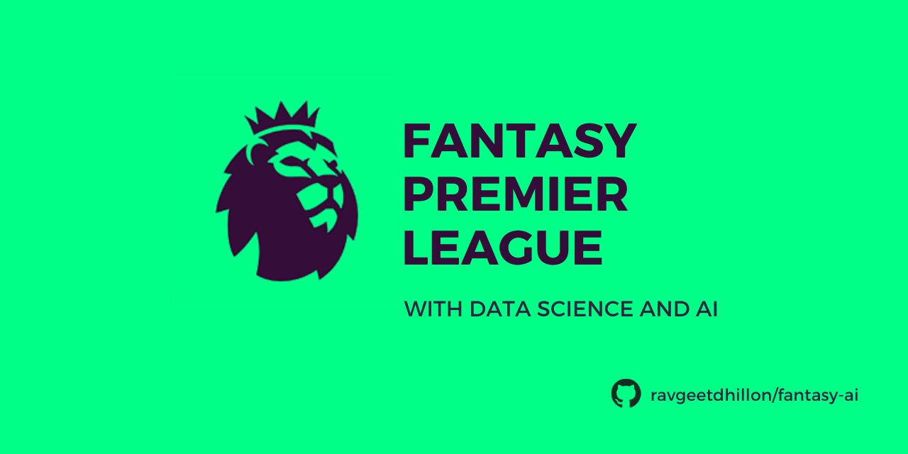

# Fantasy AI

AI for [my Fantasy Premier League team](https://fantasy.premierleague.com/entry/4914864/history).

## About

I am a huge football fan, especially the English Premier League. Also, it comes with its Fantasy Premier League which allows individuals around the world to play as managers and have fun for more than 10 months. It is so intriguing and unpredictable at times that it pushes you to the edge and tests your managing skills, patience, and your ability to foresee the future. So for this season, I decided to write an AI that can coordinate with a human manager and give him insights on what steps to take, to maximize the team points. Its been fun writing this program and I got to learn a lot. The major selling points of this AI are its **cost managing function**, ability to make **decisions based on upcoming fixtures**, **player’s form**, and give **transfer advice**. I have automated the above process using **GitHub Actions**. This [workflow](https://github.com/ravgeetdhillon/fantasyAI/blob/master/.github/workflows/main.yml) is triggered 4 hours before the gameweek deadline and sends the **email notification** regarding the transfers advice.

## When my AI would be a winner

I'm not so sure about the performance of the AI and don't want to be over ambitious. So a **top 1%** finish would be awesome. Let's see how it goes.🤞

## Blog Posts

Checkout my [first 10 gameweeks progress](https://ravgeetdhillon.github.io/blog/fantasy-premier-league-with-data-science-and-ai-first-ten-gameweeks-review/) on my blog.

You can follow me on [Twitter](https://twitter.com/ravgeetdhillon) for more updates about my progress. I tweet about my team selection and result every single gameweek.

## Links

For scraping the data from Fantasy Premier League website, this repository uses [https://github.com/vaastav/Fantasy-Premier-League](https://github.com/vaastav/Fantasy-Premier-League) by [https://github.com/vaastav](https://github.com/vaastav).
